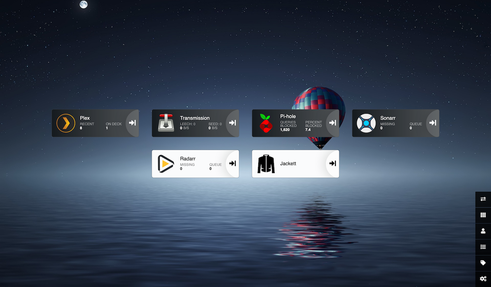

# ThinkServer

I was not able to buy a Raspberry Pi 4 so I am now using my old Lenovo ThinkPad T400s as my home server replacing the old Raspberry Pi 2 that became too slow for my current needs.



## Main goal

Main goals of my home server are network wide ad blocking with Pi-Hole and a media server with automated movies and TV shows downloads accessible also from the outside thanks to Tailscale.

## Software

- [Plex Media Server](https://www.plex.tv/)
- [Sonaar](https://sonarr.tv/)
- [Radarr](https://radarr.video/)
- [Jackett](https://github.com/Jackett/Jackett)
- [Transmission](https://transmissionbt.com/)
- [Pi-Hole](https://pi-hole.net/)
- [cloudflared](https://docs.pi-hole.net/guides/dns/cloudflared/)
- [Heimdall](https://heimdall.site/)
- [Tailscale](https://tailscale.com/)

### Docker

Most fo the software runs in Docker for easier management. See [docker-compose.yml](https://github.com/igorkulman/thinkserver/blob/main/docker-compose.yml) for exact configuration.

```bash
mkdir docker-services
cd docker-services
wget https://raw.githubusercontent.com/igorkulman/thinkserver/main/docker-compose.yml
sudo docker-compose up -d
```

#### Docker DNS

I encountered problems where Docker containers were not able to access DNS, probably because of Pi-Hole. I fixed it by setting Docker DNS to directly use Clodflare and Google DNS.

```bash
sudo nano /var/snap/docker/current/config/daemon.json # because Ubuntu Server
```

```json
{ "dns" : [ "1.1.1.1." , "8.8.8.8" ] } 
```

```bash
sudo snap restart docker
```

### Direct installation

Running [Pi-Hole](https://pi-hole.net/) and [Cloudflared](https://docs.pi-hole.net/guides/dns/cloudflared/) in Docker is quite challenging so I opted for direct installation

```bash
curl -sSL https://install.pi-hole.net | bash
pihole -a -p #remove web admin password
```
Set up cloudflared using the [Pi-Hole documentation for cloudflared](https://docs.pi-hole.net/guides/dns/cloudflared/).

Tailscale needs to be installed directly also

```bash
curl -fsSL https://tailscale.com/install.sh | sh
tailscale -up --advertise-exit-node
```

## Reduce power consumption

### Disable sleep on lid close

```bash
sudo nano /etc/systemd/logind.conf
```

set `HandleLidSwitch=ignore`, `LidSwitchIgnoreInhibited=no` and 

```bash
sudo service systemd-logind restart
```

### Turn off display when lid closed

Based on https://askubuntu.com/a/1117586

```bash
sudo apt-get install acpi-support vbetool
sudo echo "event=button/lid.*" > /etc/acpi/events/lid-button
sudo echo "action=/etc/acpi/lid.sh" >> /etc/acpi/events/lid-button
wget https://raw.githubusercontent.com/igorkulman/thinkserver/main/lid.sh
sudo cp lid.sh /etc/acpi/lid.sh
```

### Disable Turbo Boost

Based on https://askubuntu.com/a/619881

```bash
sudo apt-get install msr-tools
./turbo-boost.sh disable
```

### Disable unused hardware

```bash
sudo modprobe -r iwlwifi # Wi-Fi
sudo modprobe -r btusb # Bluetooth
sudo modprobe -r snd_hda_intel # Sound
```

### PowerTOP

Based on https://rhea.dev/articles/2017-07/Home-server-Power-saving

```bash
sudo apt-get install powertop
sudo powertop --calibrate
```

```bash
wget https://raw.githubusercontent.com/igorkulman/thinkserver/main/powertop.service
sudo cp powertop.service /lib/systemd/system/powertop.service
sudo systemctl enable --now powertop
```

## Network shares

### Samba

```bash
sudo nano /etc/samba/smb.conf
```

```conf
[movies]
    comment = Plex Movies
    path = /media/data/Movies
    public = yes
    guest only = yes
    writable = yes
    force create mode = 0666
    force directory mode = 0777
    browseable = yes

[tvshows]
    comment = Plex TV Shows
    path = /media/data/TVShows
    public = yes
    guest only = yes
    writable = yes
    force create mode = 0666
    force directory mode = 0777
    browseable = yes

[downloads]
    comment = Transmission downloads
    path = /media/data/downloads
    public = yes
    guest only = yes
    writable = yes
    force create mode = 0666
    force directory mode = 0777
    browseable = yes    
```

```bash
sudo service smbd restart
```